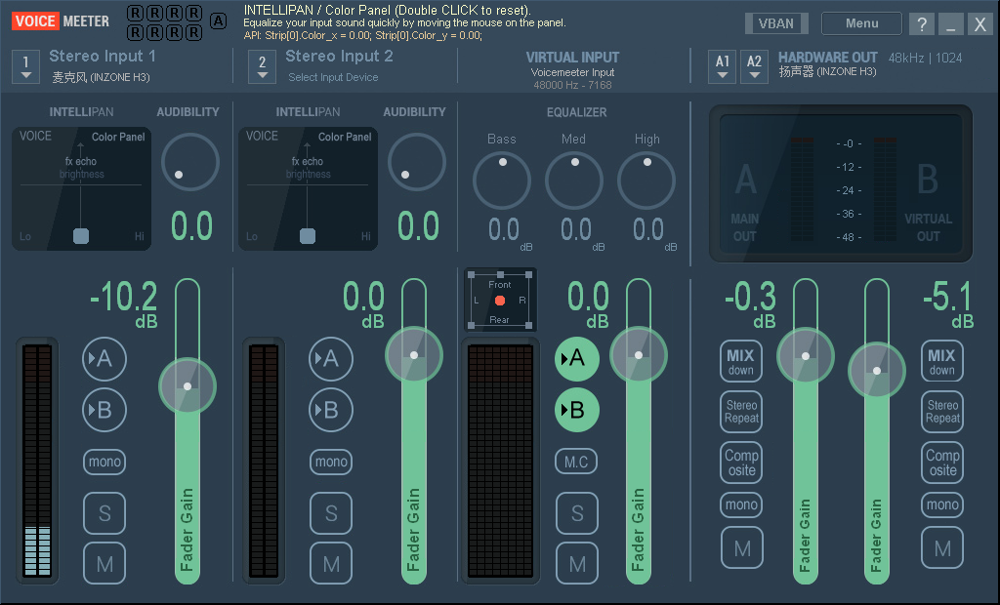
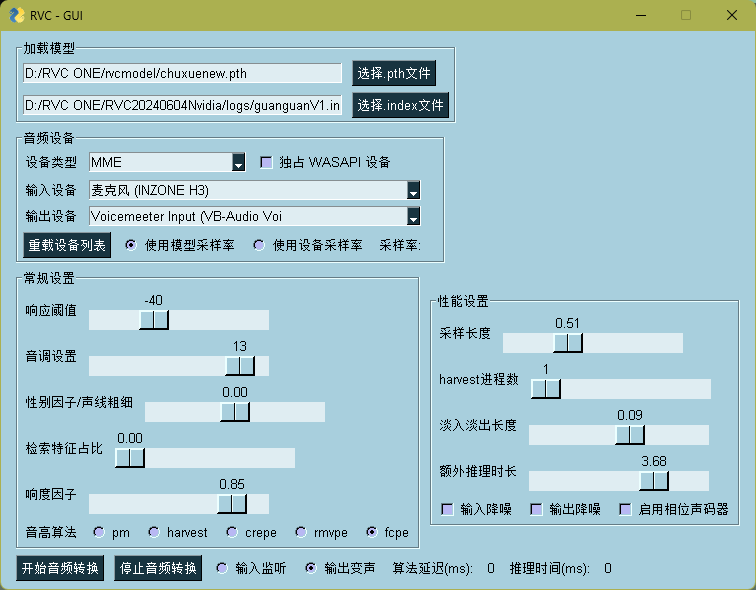

RVC初代是不自带虚拟声卡的，所以你需要安装一个Voicemeeter,作为虚拟声卡来使用。还有一个RVC的原版。
这两个在各种分享的百度网盘资料上面就可以找到。

Voicemeeter

RVC变声器
--点击go-realtimebat文件，然后就可以看到一个python程序在运行，过一会界面就出来了
——————————————————————————————————————————————————————————————————————————————————————————————————————————————————————————————————————————————————————————————————————————
《RVC变声器细节》

点开RVC软件可以看到

可以看到初代界面配置内容其实就跟各种变种版的配置内容是一样的。
变种版的也就套了个皮

这里我们设置调整好路径，不要有中文，然后将输入配置为原麦克风，将输出配置为虚拟声卡的input，也就是Voicemeeter Input (VB-Audio Voi

淡入淡出是指的是你说话的尾音，性别因子和检索默认就行了，不用管，直接两个0，采样频率看电脑配置，3060，0.4，0.5差不多
采样频率和额外推理时长，在乘以1000后，都大于推理的延迟，额外推理时长3.0差不多。

剩下的配置都一样，一样都是开始音频转换，然后RVC本体可以点击输入监听直接就监听声音了，然后还可以点击输出变声听到变声后的声音。

这里你可能疑问底膜文件为什么没有在分享里面看到，这个是不重要的，随便用一个就行了。

——————————————————————————————————————————————————————————————————————————————————————————————————————————————————————————————————————————————————————————————————————————
《声卡细节》

就两个通道重要，在input1(原麦克风) 和 A1（原扬声器） 的通道，分别选择MME里面的原本麦克风和原版扬声器。

然后就只要看input1和virtualput（虚拟声卡输出结果）就行了，这里面的A和B就是指发给自己听和发送给别人听，这里就点上虚拟声卡输出的B就好了

——————————————————————————————————————————————————————————————————————————————————————————————————————————————————————————————————————————————————————————————————————————
《最后》

RVC软件还是比较吃配置的，因此最好在云端部署，这样不会占用电脑的资源。
你的声音效果不好，很可能是因为你在本地运行有延迟。