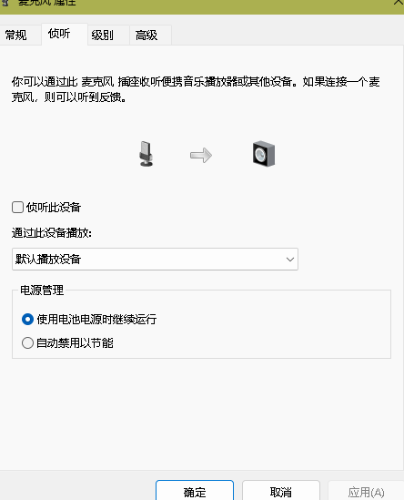
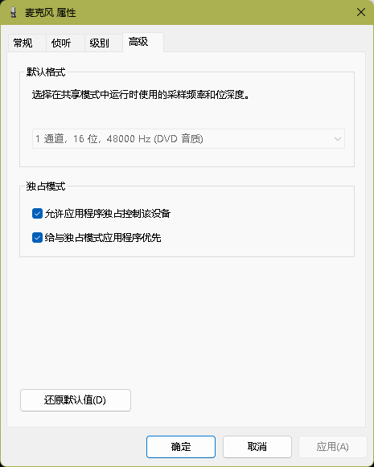
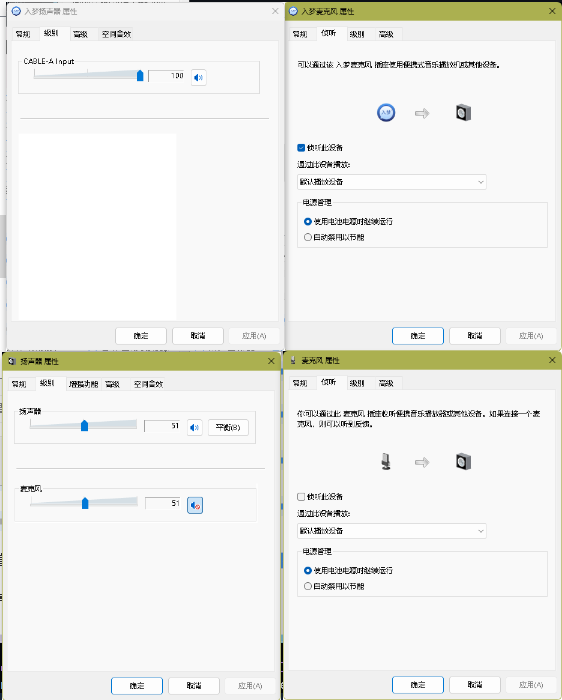
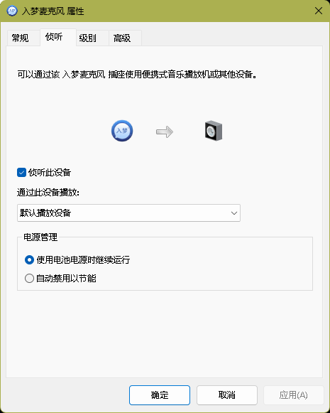

首先变声有三要素，声音（麦克风），软件，模型
软件我们可以选择 原版的开源软件也就是花儿不哭，或者是各种付费软件，当然能自己DIY一个是最好不过了

我们首先要确保你的声音能输出出来，你的耳机能听到。
现在你可以在系统音频中

将侦听自己的声音勾选上，我们的第一步完成了。
而耳机能听到，你自己听视频就可以完成了。

接下来选择你喜欢的软件，我接触过云梦，入梦，原版，AI版，总结一下就是如果你想要真正搞懂其中的奥妙，以及不想下载什么奇奇怪怪的东西，最好选择原版。
——————————————————————————————————————————————————————————————————————————————————————————————————————————————————————————————————————————————————————————————————————————
我们以入梦软件举例

首先我们要安装他们的驱动，安装之后，就会出现一个虚拟的麦克风，一个虚拟的扬声器。

我们要理解这两个东西，虚拟麦克风就是一个驱动的input，负责接收原版麦克风传递过来的信号
而虚拟扬声器就是驱动ouput负责输出处理后的变声。
有了这两个东西，需要设置一下。我们在使用的时候，电脑要将扬声器设为原版扬声器，不然是听不到声音的。
因为在不输入麦克风时候，虚拟扬声器是没有电脑传输的信号的。
然后我们的麦克风可以随意，因为在软件，聊天里面麦克风都是可以切换的。
并且你不用担心传输的逻辑问题，麦克风是否输入到了虚拟麦克风里面，因为这是在软件里面配置过的。
这里教大家是怎么设置的，在音频设置界面你右键你的设备可以选择默认，这里你就大胆将默认设备
与默认通讯设备设置成一起就好了，选啥麦克风就设啥，你可以把默认麦克风设置在虚拟麦克风上，这样你可以在聊天的时候直接选择虚拟的麦克风

接下是极其容易犯错的重点，

我们在虚拟声卡，虚拟麦克风，原麦克风，原扬声器里面，都要配置好采样频率和位深度，一切都跟原本的初始值一样。
比如我的耳机麦克风是1通道，16位，48000 Hz (DVD音质)，并且它是不能变的。那么我的虚拟麦克风也要如此。
扬声器16位，48000 Hz (DVD音质)，我的虚拟扬声器同样也是如此。

这样才符合数据流的交换，避免格式的冲突
——————————————————————————————————————————————————————————————————————————————————————————————————————————————————————————————————————————————————————————————————————————
设置完毕后，正常情况下是没有问题的，为了防止你们出现一种情况，程序在运行，推理时间也在变，声音却不见了的问题。
我建议你检测一下

是否跟这个对的上，我就是动了这四个数值没有听到，才卡了好久。
这里的原扬声器的麦克风被禁用，因为这样是在耳机里面听到本体的声音，入梦扬声器声音选择最大，方便输出
入梦麦克风是大坑，你需要设置成默认播放设备，原版麦克风默认就好了。
——————————————————————————————————————————————————————————————————————————————————————————————————————————————————————————————————————————————————————————————————————————

请先看下面的引导（先随便配置一下，当我们可以变声了再调试）

接下来我们导入模型，将模型和底模文件导入，调教好参数

模型啥都行

然后在输入通道我们配置为自己的麦克风，然后通过入梦扬声器输出这样就实现变声

我的配置是rtx3060,打csgo有200上下的帧，体感还行，就按照这样配置吧

阈值为0，过滤杂音，声音延迟看你的成品卡不卡，越小越好嘛，如果卡就上调就行了
音调，男变女，+12，女变男-12，如此。高品质占用4，这个不重要。
微调-1.27，这是调配你的声音尖锐的，看实际需求调，左粗右细。
淡入淡出，是调整你的说话的速度的，左边放慢，右边加快。放慢可能变成一字一句，加快可能会卡。
而底膜就是Ai帮助你优化语气吧，可以不理会。
额外推理可以增加你的清晰度，但是同样也会提高你的延迟。
响度就是放大对你麦克风的灵敏度，大了可以说悄悄话，小了可以避免破音。

CPU算法
GPU算法
这两个算法就按照我的选吧，配置到位就行了。
——————————————————————————————————————————————————————————————————————————————————————————————————————————————————————————————————————————————————————————————————————————

大概的配置一下后，我们点击保存配置，然后运行程序

在任务管理器里面可以看到出现几个python文件，运行成功。
先初始化模型然后再点运行就可以听到风扇转了。
这个时候推理时间也出来了。

挺好的，于是我们就可以监听我们的变声成果了，在声音设置界面，点击虚拟麦克风，监听这个虚拟麦克风。
我们的虚拟麦克风的声音是输出到虚拟扬声器里面，然后再传出变声的，因此，监听麦克风也就监听了声音。
这也是为什么，只要我们设置虚拟麦克风为默认设备就行了。

——————————————————————————————————————————————————————————————————————————————————————————————————————————————————————————————————————————————————————————————————————————

我们就可以再调试配置来达到更好的效果了。

要注意的是调好设置后，你需要再保存配置，才能听到调完的效果，不能仅仅只是设置就忘了。

——————————————————————————————————————————————————————————————————————————————————————————————————————————————————————————————————————————————————————————————————————————

接下来，我将会讲解如何使用原版软件，理解原版软件。
如何自己练出想要的声音，并且如何设置练声程序在云显卡服务器上面。
扩展：试玩日语软件，翻译日语版软件。如何DIY出自己想要的变声程序呢。

当然如果你有好的建议，请联系我的QQ2773889133，谢谢你的观看！